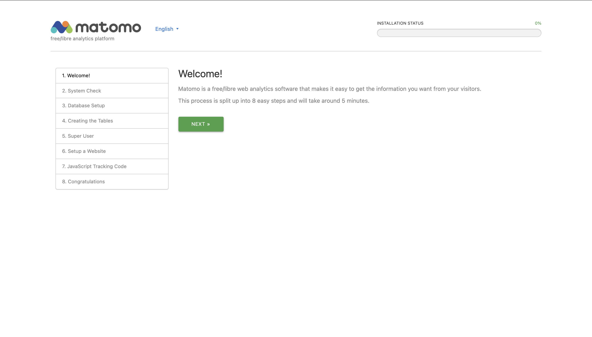
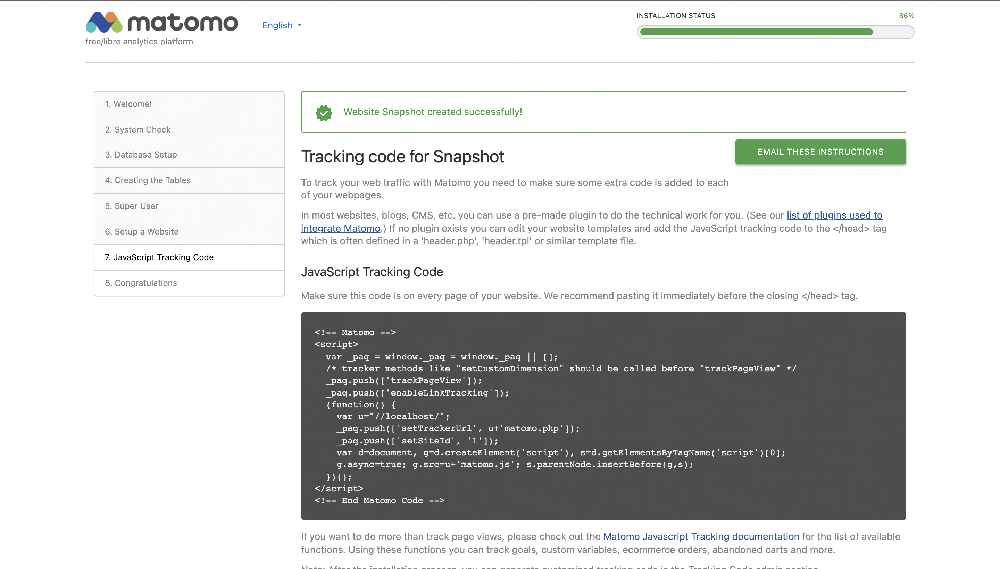

# Matomo-on-premises

This document explain how to setup the Matomo analytics tool on premises with docker image.

The docker image which I used at the time of setup is **matomo:4.5.0-apache** and latest docker image available is **matomo:4.6.2-apache**

Steps for running Matomo -

1. Create a db on database server.
2. Create EC2 instance for running *Matomo*
3. Give Access on port 80 with security group or what ever preferred port number.
4. SSH the EC2 machine.
5. install docker on EC2 machine with appropriate config.
6. Create folder *Matomo*
7. cd *Matomo*
8. create env file .env.production with the variable -
  - MATOMO_DATABASE_HOST=**host url of my sql machine on which the db is created on step 1** 
  - MATOMO_DATABASE_USERNAME=**user name for my sql db**
  - MATOMO_DATABASE_PASSWORD=**password for user**
  - MATOMO_DATABASE_DBNAME=**database name created in step 1**
9. execute the below sh command for running the Matomo with docker. Change the port if any.

```sh
docker run --env-file "$(pwd)/.env.production" --restart=always --name weatherspork-matomo -p 80:80 -v "$(pwd)/data:/var/www/html" -d matomo:4.5.0-apache
```

> ## Configure Matomo for the first time

Goto the url of Matomo

Matomo welcome screen will appear, *Click next*



Matomo will check to make sure that your server meets the requirements, when all the requirement are met *Click next* 


Setup database, the details are prefilled if .env.production is setup while running Matomo docker container.


Create the tables , *Click next*


Setup super user, *Click next*


Setup the first website to track, *Click next*


Tracking code - copy the code to use it in the application, *Click next*



Congratulations - Matomo setup complete , *Click Continue to Matomo*


